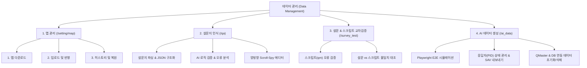

# 데이터 관리 (Data Management) 통합 기능 명세서

---

## 📌 문서 개요
본 문서는 SurveyOn 플랫폼의 **데이터 관리 (Data Management)** 서비스 내 모든 메뉴와 핵심 기능, UI/UX 구조 및 비즈니스 로직을 체계적으로 정리한 통합 기능 명세서입니다.

---

## 📂 전체 메뉴 구조

---

## 1️⃣ 맵 관리 (`/data_management/setting/map`)

조사 프로젝트의 **변수 맵(Excel Map)** 정보를 다운로드, 검증, 일괄 수정 및 히스토리 복원하는 데이터 관리의 핵심 기본 메뉴입니다.

### 🔹 주요 탭 구성 & 핵심 기능
1. **1. 맵 다운로드 (Tab 1)**
   - **기능**: HWP / Docx 기획서 및 데이터베이스 기반 최신 맵(Excel)을 생성하여 다운로드.
   - **Two-Track 내보내기 지원**:
     - `서버 직접 생성`: 백엔드 API에서 엑셀 파일 바이너리를 생성하여 브라우저에서 직접 다운로드.
     - `PC 도구 분기`: `surveyonmap://` 커스텀 프로토콜을 호출하여 로컬 PC 도구와 연동 실행.
   - **프로그레스바 오버레이**: 맵 파일 생성 및 내보내기 처리 중 실시간 프로그레스 모달(`renderExportProgressModal`) 제공.

2. **2. 업로드 및 반영 (Tab 2)**
   - **기능**: 수정된 엑셀(Excel) 맵 파일 업로드, 유효성 검증 및 DB 일괄 반영.
   - **유효성 검증 항목**: 변수 ID 중복, 문항 유형(single, multi, scale, open 등), 보기/척도 코드 규격 및 필수 필드 검증.
   - **에러 핸들링 안내**: 검증 실패 시 상단 고정 에러 배너 제공:
     > `※ 변경사항은 반영되지 않았습니다. [맵 다운로드] 탭에서 최신 엑셀을 다시 내려받아 작업해주세요.`
   - **배치 맵 편집기 (`BatchMapEditModal`)**:
     - 엑셀 업로드 없이 웹 화면상에서 전체 변수 맵을 테이블 형태로 직접 확인하고 일괄 편집/수정 기능 제공.
     - 모달 바디 높이 안정화 (탭 3 히스토리 영역 최소 높이 `210px` 유지).

3. **3. 히스토리 및 복원 (Tab 3)**
   - **기능**: 프로젝트의 이전 맵 변경 및 업로드 이력 관리.
   - **주요 동작**: 
     - 변경 이력별 시점, 작업자, 이력 엑셀 다운로드 버튼 제공.
     - **원클릭 맵 복원**: 원하는 과거 시점의 맵 데이터로 1초 만에 프로젝트 전체 맵 복원.

---

## 2️⃣ 설문지 인식 (`/data_management/qa`)

HWP, DOCX, PDF 등 다양한 형식의 **설문지 원문 문서를 AI 엔진이 자동 분석**하여 문항 구조(QNum, QType, 옵션, 척도, 로직)를 정밀 파싱하고 JSON 데이터로 전환하는 메뉴입니다.

### 🔹 주요 기능
1. **설문지 문서 구조화 파싱 (AI Structural Parsing)**
   - **입력**: HWP, DOCX, PDF 파일 업로드.
   - **출력**: 문항 번호(`qnum`), 문항 유형(`single`, `multi`, `scale`, `open`, `rank`, `grid_multi`, `personal_info`), 질문 문구(`qtext`), 보기/척도 리스트, 전역/진입/스킵/루프 로직 자동 추출.
   - **특수 문항 자동 감지**:
     - `multi`: 배타 항목(`is_exclusive`), 기타 주관식 기입 항목(`has_open_ended`) 등 자동 처리.
     - `rank`: 순위 제한(`rank_limit`), 랜덤 배치(`is_randomized`) 자동 지정.
     - `loop`: 로테이션 루프 시작/종료 구간 지정 및 종속 문항(`loop_base_qnum`) 연동.

2. **AI 로직 검증 & 이슈 분석 (AI Validation)**
   - 문항 간 진입 조건, 스킵 로직, 표시 조건, 유효성 조건의 모순 및 오류를 AI가 정밀 분석.
   - **심각도 분류**:
     - 🚨 `CRITICAL (심각)`: 설문 응답 불가 또는 로직 데드락
     - ⚠️ `ERROR (오류)`: 기획서 불일치 또는 데이터 왜곡 가능성
     - 💡 `WARNING (확인)`: 검토 필요 항목

3. **양방향 Scroll-Spy 에디터 인터페이스**
   - **좌측 색인 리스트 ↔ 우측 카드 뷰 양방향 동기화**:
     - 좌측 문항 번호 클릭 시 우측 카드로 부드럽게 스크롤 이동 (`scrollIntoView`).
     - 우측 영역 스크롤 시 교차 위치 계산을 통해 좌측 색인 활성화 항목 자동 스위칭.
   - **문항 인라인 수정 및 추가/삭제**:
     - 파싱된 문항 문구, 유형, 로직을 직접 수정하거나 신규 문항 삽입 팝업 지원.

4. **SignalR 실시간 작업 진행률 시각화**
   - WebSocket(`task-progress` Hub)을 수신하여 AI 파싱 단계별 프로그레스바(`QaProgressModal`) 및 실시간 메시지 업데이트.

---

## 3️⃣ 설문 & 스크립트 교차검증 (`/data_management/survey_test`)

기획서(설문지 원문 및 JSON 파싱본)와 **실제 온라인 조사 C# 엔진 스크립트(`qm`)** 간의 불일치 및 문법 오류를 대조 검증하는 메뉴입니다.

### 🔹 주요 기능
1. **2대 핵심 검증 섹션**
   - **① 스크립트(qm) 오류 (`syntax`)**:
     - 스크립트 내부 문법 결함 및 타입 불일치 검증.
     - 예: 문자열 반환 함수(`fopen`)를 정수형 숫자와 직접 비교하여 발생하는 C# 런타임/컴파일 에러(CS0019) 감지 및 대안 제시 (`fint(...)` 래핑 가이드).
   - **② 설문 vs 스크립트 불일치 (`cross`)**:
     - 기획서 명시 보기 옵션과 실제 스크립트 상의 보기 옵션 개수/코드 불일치 감지.
     - 기획서에 없는 기타 보기가 스크립트에 임의 추가되어 분석 혼선을 유발하는 항목 대조 리포팅.

2. **이슈 카드 시각화 & 코드 스니펫 제공 (`ErrorCard`)**
   - 오류 발생 문항, 제목, 상세 원인 설명 및 해당 스크립트 코드 스니펫(`codeSnippet`) 하이라이팅 표시.
   - `심각`, `오류`, `확인` 3단계 뱃지 라벨링 및 개별 탭 상태 집계.

3. **검증 통계 대시보드**
   - 총 변수/문항 수, AI 검증 비용(USD), 소요 시간(초) 실시간 카드 표출.

---

## 4️⃣ AI 데이터 생성 (`/data_management/ai_data`)

Playwright 기반 **AI 자동화 봇(Runner)**을 가동하여 온라인 설문 URL을 대상으로 자동으로 가상 응답(PID)을 진행하고, 완주/탈락 데이터 검증 및 SPSS(.sav) 내보내기를 수행하는 메뉴입니다.

### 🔹 주요 기능
1. **E2E Playwright 시뮬레이션 가동**
   - **PID 생성 옵션**:
     - `자동 생성`: 1~50개의 가상 PID를 자동 생성하여 시뮬레이션 수행.
     - `수동 목록 지정`: 테스트할 PID 목록을 직접 입력하여 실행.
   - **커스텀 프로토콜 시동**:
     - `surveyonrunner://run` 프로토콜을 이용해 백엔드 API에서 발급된 1회용 티켓으로 로컬 Runner 및 중앙 서버 동기화 실행.

2. **응답자(PID) 상태 트래킹 & 결함 원인 자동 분류**
   - **진행 상태 레벨**:
     - `✓ 통과 (pass/success)`: 설문 정상 완주
     - `✕ 중단/결함 (defect/fail)`: 중간 탈락 또는 에러 발생
     - `⏸ 재개대기 (paused)`: 수동 검증 후 재개 대기 중인 항목
     - `실행중 (running)` / `대기 (pending)`
   - **결함 클래스 분류 (`FAILURE_CLASS_MAP`)**:
     - `ScreenoutQuota`: 쿼터 초과 또는 스크린아웃 탈락
     - `ServerEngineException`: QMaster 서버 엔진 예외 (설문 봇 문제 아님)
     - `SurveyScriptDefect`: 설문 스크립트 결함
     - `BotUnsupported` / `SurveyClosed` / `WrongServerOrUrl`

3. **QMaster 연동 데이터 초기화 & 삭제**
   - 선택 또는 전체 PID에 대해 DB 기록 삭제뿐만 아니라 **QMaster 실사 서버 API(`resetDataWithKey`)까지 2단계 동시 연동 초기화**.
   - 실사 보호 가드 적용 및 안전 대화상자 제공.

4. **SPSS (.sav) 바이너리 내보내기**
   - 가상 응답자들의 로우 데이터(Raw Data)를 SPSS 정식 파일 형식(`.sav`)으로 즉시 생성 및 웹 직접 다운로드.

---

## 5️⃣ 공통 네비게이션 & 프로젝트 세션 관리

- **글로벌 통합 메뉴바 (`MenuBar.jsx`)**:
  - `H-SRT`, `데이터 관리`, `AI 오픈분석`, `실사관리` 모듈 간 원클릭 스위칭.
- **프로젝트 선택 모달 (`ProjectSelectionModal.jsx`)**:
  - 프로젝트 번호(`projectnum`), 조사명(`projectname`), 서버명(`servername`), 연동 포프(`merge_pn`) 세션 동기화 및 프로젝트 자동 연결.
- **스마트 그리드 공통 컴포넌트 (`KendoGridV2`, `KendoGridV3`)**:
  - 절대 데이터 인덱스(`data.indexOf`) 기반 행 리오더링, 가상 스크롤, 오토 스크롤(Auto-scroll) 지원.

---
*작성일: 2026-09-09*  
*작성자: Antigravity AI Assistant*
